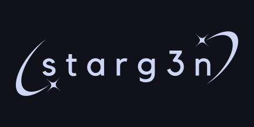

<p align="center">
      
</p>

<p align="center">
  <a href="https://github.com/starg3n/starg3n.github.io/stargazers"></a>
  <a href="https://github.com/starg3n/starg3n.github.io/releases/latest"></a>
 <!-- <a href="https://github.com/starg3n/starg3n.github.io/issues"></a> -->

<p><b></b></p>
</p>

## Overview
Starg3n (Pronounced stɑː ʤɛn) is a static gamesite project created and maintained by [Appak](https://appak.neocities.org), under the _starg3n_ moniker. The goal of starg3n is to provide a plethora of good, high quality games (and tools), easy to accesses from any computer, with an aesthetically pleasing [Catppuccin](https://catppuccin.com/) Mocha theme to boot. Starg3n also provides an extensive tutorial on unblocking, helping anyone make make a mirror, a copy, run it locally, or to contribute to the project. Starg3n is easy to access, even if the main website is unavailable in your area.
## Features
### Static
Starg3n is a static site. this means you can download it from the [releases page](https://github.com/starg3n/starg3n.github.io/releases/latest), or any other way you can download a github repo. You can then open ```index.html```, and every link should work as intended, keeping you in your downloaded "client" (Only on v6.0.0+). If an update is pushed that you dislike, you can always download an older version to play on, making your starg3n experience fully customizable.
> [!WARNING]
> When downloaded, starg3n is around 1.8 Gigabytes, so keep that in mind if you have low storage. (i.e. Chromebooks)
### Local Hosting / Github Codespaces
If you are unable to download starg3n, you can use Github Codespaces to run it yourself. To learn how to do this, read the [wiki page on it](https://github.com/starg3n/starg3n.github.io/wiki/Starg3n:-Local-Hosting).
### Customizable
Every single color and visual feature in Starg3n can be customized using the [css file](https://github.com/starg3n/starg3n.github.io/blob/main/data/style.css). This file has colors, and effects, (along with a guide) for every page with the signature starg3n colors.
Along with this, you can add and remove games as you wish. Most major pages have comments explaining what parts do, so if you have very little experience with css, html and javascript, you can still manage to change what you want.
 
## Games
Starg3n has a wide variety of games. From ports to rom collections to emulators and more, Starg3n's variety of high-quality content is what makes it stand out from the dense crowd of unblocked game websites.
- Spelunky Classic - a rougelite where you explore a cave
- Pico-8 Collection - a small collection of pico-8 roms
- Bitburner - a text based cookie clicker-type game where you automate hacking
- Rugg Rouge - a turn based dungeon crawling game
- Beepbox - small music making tool
- Gba Collection - every gba game ever released by nintendo
- Sm64 Wasm - a port of the original super mario 64 to the web
- Hl1 - a port of the original half life 1 to the web
- Eaglercraft - a port of minecraft to the web
- Ds Emulator - a ds emulator
- Yume Nikki - a surreal exploration rpg
- Flash Emulator - flash emulator
- Cookie Clicker - a game where you automate clicking a cookie

## Documentation
Starg3n being open source means that anyone can fork and edit their own copy. Because of this, Starg3n has an extensive **[Wiki](https://github.com/starg3n/starg3n.github.io/wiki)** with documentation on setting up localhost, contributing, making sites similar to starg3n, and other useful information, such as game documentation for findning ds roms, flash roms, and more.

## Official Mirrors
starg3n has a few forks that are the official site, for if the main one goes down.
_Want to get **your** fork onto this page? create a pull request adding your link!_
- [LOVEWAREZ Mirror](https://lovewarez.github.io/)
- [mil0besilly Mirror](https://mil0besilly.pages.gay)

## Credits
Appakling / Starg3n : main development

SixVertical : bugfixes

UsrLoca1 : got localhost working

Gaebean : playtesting 

## Help
if you have any problems, you can:
- make an issue on this repo
- start a discussion on this repo
- dm _appakling_ on discord
